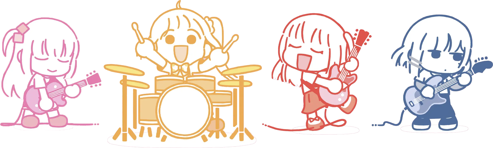

---

Anime Without Equal <strong>「ぼっち・ざ・ろっく！」</strong>  
Favorite Character (NO CONTEST) <strong>「結束バンド」</strong> 

 

   
  
  
   

<!--
**ReRokutosei/ReRokutosei** is a ✨ _special_ ✨ repository because its `README.md` (this file) appears on your GitHub profile.

Here are some ideas to get you started:

- 🔭 I’m currently working on ...
- 🌱 I’m currently learning ...
- 👯 I’m looking to collaborate on ...
- 🤔 I’m looking for help with ...
- 💬 Ask me about ...
- 📫 How to reach me: ...
- 😄 Pronouns: ...
- ⚡ Fun fact: ...
-->
